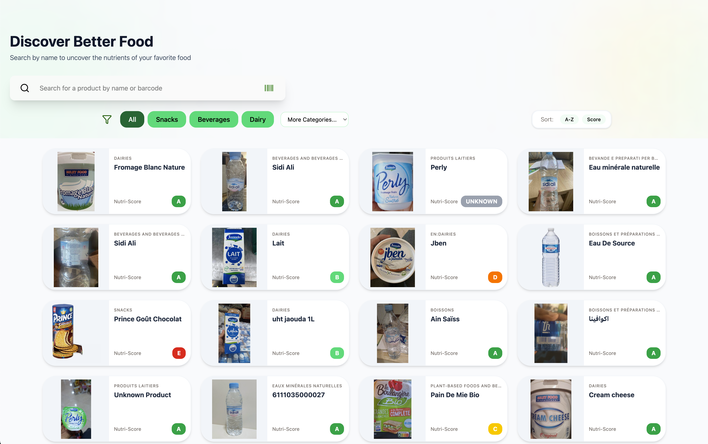
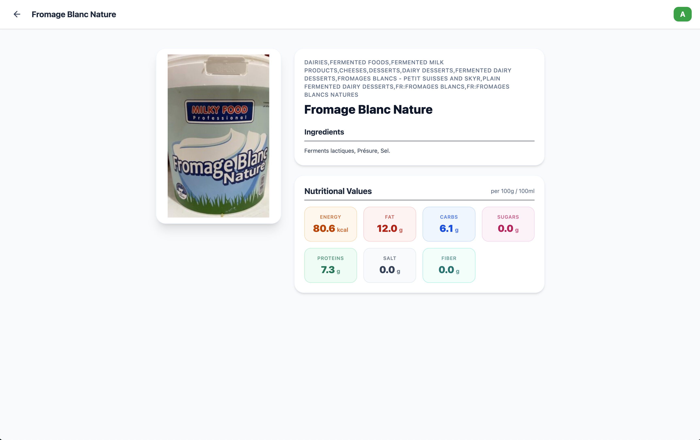

# 🍏 EatRight


**EatRight** is a sleek, dynamic web application designed to help users discover nutritional values of their favorite foods. Leveraging the power of the Open Food Facts API, it provides a beautifully designed interface to search, filter, and analyze the nutritional profiles and ingredients of thousands of products.

---

## ✨ Features

- **🔍 Smart Search:** Quickly find products by searching for their name or barcode.
- **🏷 Category Filtering:** Easily discover products within specific categories such as Snacks, Beverages, Dairy, and more.
- **📊 Advanced Sorting:** Sort products alphabetically (A-Z) or by their Nutri-Score grade to find the healthiest options quickly.
- **📈 Detailed Nutritional Profiles:** Access in-depth information about products, including an ingredient list and detailed macronutrients (Energy, Fat, Carbs, Sugars, Proteins, Salt, Fiber).
- **🥇 Nutri-Score Integration:** Instantly see the health grade of a product with visible Nutri-Score badges.
- **🎨 Modern & Responsive UI:** A premium, glass-morphic, and dynamic user interface built with modern web aesthetics using Tailwind CSS v4.

---

## 📸 Screenshots

| Dashboard & Search | Detailed Nutritional View |
| :---: | :---: |
|  |  |
| *View and filter multiple products seamlessly.* | *Detailed nutritional information and ingredients.* |

---

## 🎥 Demo

Watch the full demonstration of the EatRight application on YouTube:

[](https://www.youtube.com/watch?v=icx4h7M1AwU)

*(Note: Click the image above to watch the video, or [click here](https://www.youtube.com/watch?v=icx4h7M1AwU).*

---

## 🛠 Tech Stack

- **Frontend Framework:** React 19 + Vite
- **Styling:** Tailwind CSS v4
- **Routing:** React Router v7
- **Icons:** Lucide React
- **Data Source:** [@openfoodfacts/openfoodfacts-nodejs](https://github.com/openfoodfacts/openfoodfacts-nodejs)

---

## 🚀 Installation & Setup

To run this project locally, simply follow these steps:

### 1. Clone the repository
```bash
git clone https://github.com/avyuktcodes/Eat_Right-.git
cd EatRight/frontend
```

### 2. Install Dependencies
Make sure you have Node.js installed. Then run:
```bash
npm install
```

### 3. Start the Development Server
```bash
npm run dev
```

The application will typically start on `http://localhost:5173`. Open your browser and start exploring!

---

## 🏗 Usage

1. **Search**: Use the search bar on the top to type in a food product name (e.g., "Lait" or "Fromage Blanc").
2. **Filter & Sort**: Click on the quick-access pill buttons (All, Snacks, Beverages, Dairy) to filter down products. Use the Sort toggle to switch between alphabetical sorting and health-score sorting.
3. **Analyze**: Click on any product card to open the detailed view, which elegantly breaks down the `Nutritional Values` into colored metrics and lists all `Ingredients`.

---

